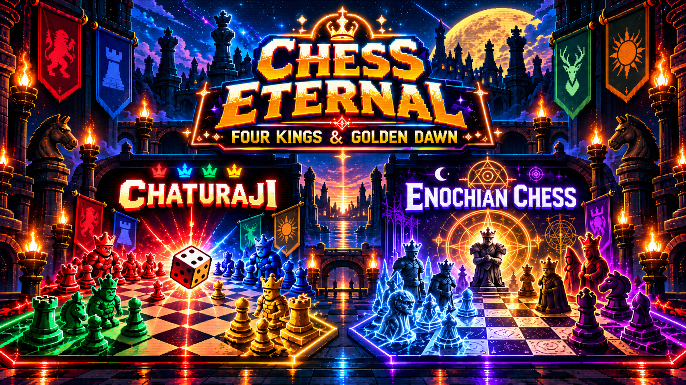

<div align="center">

<h1><a href="https://game-server-production-5449.up.railway.app/index.html">⚔️ Chess Eternal: Four Kings &amp; Golden Dawn — PLAY HERE ⚡</a></h1>

<a href="https://khrollo963.github.io/Chess-Eternal-Blitz-/"></a>

**Two forgotten chess variants. One pixel-perfect arcade cabinet. Local play and private online battles.**

[](https://khrollo963.github.io/Chess-Eternal-Blitz-/)


[Quick start](#-quick-start) · [What's inside](#-whats-inside) · [Multiplayer](#-private-multiplayer) · [Development](#-development-and-exports) · [Credits](#-credits)

</div>

---

## 💡 What is this?

Three readable HTML pages resurrect two of history's strangest chess offshoots — a dice-driven four-king battle royale and a Victorian occult team variant — in glowing, scanline-soaked retro-arcade style. Local play needs no account, frontend build or runtime CDN. Enochian also includes private online rooms backed by an authoritative server, with guest casual play and gated ranked accounts.

## 📋 Table of contents

- [Quick start](#-quick-start)
- [What's inside](#-whats-inside)
  - [Chaturaji — Four Kings Arcade](#-chaturaji--four-kings-arcade)
  - [Enochian Chess — 2v2 Mystical Warfare](#-enochian-chess--2v2-mystical-warfare)
  - [One shared launcher](#-one-shared-launcher)
- [Why it's fun](#-why-its-fun)
- [Built with](#-built-with)
- [Private multiplayer](#-private-multiplayer)
- [Development and exports](#-development-and-exports)
- [Credits](#-credits)
- [License](#-license)

## 🚀 Quick start

**[Play Chess Eternal in your browser](https://khrollo963.github.io/Chess-Eternal-Blitz-/)** on desktop or mobile. For a local preview, serve the repository root with an existing static HTTP server and open its `index.html` URL. Keep all three pages on the same origin so the games share the launcher's navigation and statistics bridge. Local gameplay needs no server dependency installation; online rooms need a configured, ready multiplayer backend.

The source is now three pages: [`index.html`](index.html) is the launcher, [`chaturaji.html`](chaturaji.html) is Four Kings Arcade, and [`enochian.html`](enochian.html) is Golden Dawn Chess. The launcher loads each game once and keeps it mounted when you return to the menu or switch games. The source `index.html` is no longer self-contained; opening it alone or through `file://` is not the supported preview path.

For a portable ZIP, run `node scripts/package-client.mjs` with an existing Node.js installation. It writes `dist/chess-eternal-blitz.zip` with exactly the three HTML files at its root. Extract them together and serve that folder over HTTP. Add `--single-html` to also generate `dist/index.html`, a literal-source standalone export with safely escaped `srcdoc` game pages. Both forms retain inline artwork and embedded SDKs; README images are optional for play. Online multiplayer still needs its backend, even in the single-HTML export.

To check this migration with an existing Node.js installation, run `node --test tests/client-layout.test.mjs` and `node scripts/check-client-preservation.mjs`. `node scripts/extract-game-pages.mjs` retrieves the original game payloads from the recorded Git revision; it is safe to rerun on identical pages and refuses to overwrite edited game source.

---

## 🕹️ What's Inside

### 🎲 CHATURAJI — Four Kings Arcade
The ancient four-player ancestor of chess, dice and all.

- **4 armies, 1 board, dice-driven turns** — roll two four-sided dice and move whatever piece they call
- **Free-for-all survival** — no check, no checkmate, just outright capture; last king standing wins
- **Scoring & king-fall bonuses** — wipe out a kingdom and scoop every point still on it
- **Pawn resurrection** — march a pawn to the far edge and call a fallen Elephant, Horse, or Boat back into the fight
- **4 CPU difficulty tiers**, from *Easy* to *Grand Master*
- **Geomancy collectibles** — every finished game casts one of 16 classical geomantic figures based on the final standings
- **Achievements, session history, swappable board & piece themes** (Classic, Poker, Kamea, Mystical, Egyptian Gods, Hebrew Letters, and more)

### ⚡ ENOCHIAN CHESS — 2v2 Mystical Warfare
Chess reimagined by 19th-century occultists — now a genuine team game.

- **True 2v2 teams** — Red & Yellow vs. Blue & Black, zero friendly fire, your CPU teammate fights *with* you
- **King capture ≠ elimination** — a fallen king freezes their whole army in place as living obstacles, not empty squares
- **Faithful fairy-chess movement** — the Queen leaps like a true Alibaba, pawns are permanently bound to the piece behind them and can only be promoted once that piece has fallen
- **Chunky 8-bit piece sprites**, a live move log, hover/tap tooltips for every piece, and a full game-over screen
- **Fast-forward mode** once you're eliminated, so you're never stuck watching the CPUs play it out at normal speed
- **Repaired CPU evaluation and session lifecycle** — typed pawns and king captures are evaluated consistently, and obsolete CPU callbacks cannot advance a reset or reopened match
- **Private online rooms** — guest casual play, readiness, server bots, seat recovery, and approved human-only prisoner exchange

The preserved rule baseline is the existing playable reconstruction, not every historical rule printed in the rules tab. Captured armies freeze, alliances stay fixed, and established movement/promotion behavior remains shared by local play and the server. See the [rule audit](docs/superpowers/specs/2026-10-02-enochian-rule-audit.md) for historical differences and deferred mechanics. Chaturaji remains byte-identical to its original decoded source.

### 🌐 One Shared Launcher
A single retro arcade menu ties both games together, complete with a **Cross-Game Statistics** dashboard tracking your total games, wins, win rate, and geomantic figures cast — across both titles, in one place.

---

## ✨ Why It's Fun

- 🎨 **Pixel-art, CRT-scanline aesthetic** throughout — this isn't a spreadsheet with chess rules bolted on, it *feels* like a cabinet you'd find in an arcade's forgotten back corner
- 🧠 **Smart, tunable AI** on every difficulty, so solo play never feels like a coin flip
- 🔊 **Full retro sound design** — chiptune blips for every move, capture, promotion, and king-fall
- 📱 **Responsive** — plays on desktop and mobile alike
- 🏆 **Persistent progress** — achievements, collectibles, and session history are saved locally, no account required
- 🥚 A few secrets are tucked away for the curious

---

## 🛠️ Built With

The arcade client uses **HTML, CSS, and vanilla JavaScript**, with inline artwork, sound synthesis and local statistics. Pinned Colyseus and Supabase browser SDKs are embedded with their license notices; no runtime CDN is required. The canonical Enochian engine is extracted from its readable game page for authoritative server builds, so client and server do not maintain separate rules.

Online play uses **Bun 1.4.2 + Colyseus**, a private **Supabase PostgreSQL** ledger and **Supabase Auth**, with **Railway** selected for one process/replica hosting. Local games continue to work without an online account or backend. See the [server README](server/README.md) for setup, pinned dependencies, persistence and operations.

---

## 🌐 Private Multiplayer

**[Try the deployed multiplayer arcade](https://game-server-production-5449.up.railway.app/index.html).** Open Enochian's multiplayer controls when a ready backend is configured. Create a private casual room or enter a friend's room code, choose an available color, and mark yourself ready. Room codes are public invitations; your private recovery credential owns your seat. Casual guests need no ranked account. The server validates moves, supplies bots where appropriate, and publishes committed state to everyone.

A disconnected casual player has a **cumulative three-minute allowance** to reclaim their seat; repeated departures do not reset it. Accepted bot moves remain part of the match. Eligible connected human captors can offer the approved two-king exchange; offers expire after 60 seconds and invalidate when play or control changes. Placement is atomic and safe, and completed matches stay final.

Ranked requires four distinct verified human accounts and never replaces a missing player with a bot. A departure pauses play, with a cumulative five-minute player allowance. Ranked is **disabled by default** until account/provider configuration, physical-device acceptance and release gates pass. Sign-in uses a separate top-level page with a return-code fallback for embedded platforms. Platform identities are not automatically linked.

Railway is the selected host; a configured domain alone does not establish a playable deployment. The static source leaves online creation unavailable when no endpoint is configured. The hosted server can serve the canonical pages with response-only public endpoint configuration. Only the public HTTPS/WSS endpoint belongs in client configuration, never database credentials or private account keys. Read the [client protocol](docs/multiplayer/client-protocol.md), [operations guide](docs/multiplayer/operations.md) and [release checklist](docs/multiplayer/release-checklist.md) before enabling or distributing online play. Actual platform draft uploads, live provider flows and separate-device matches remain release acceptance steps.

---

## 🧰 Development and Exports

With an existing Node.js installation, run the client checks and exports from the repository root:

```sh
node --test tests/*.test.mjs
node scripts/check-client-preservation.mjs
node scripts/extract-enochian-engine.mjs --check
node scripts/embed-client-sdks.mjs --check
node scripts/package-client.mjs --single-html
```

The SDK freshness check needs the approved backend dependencies already present. Generated artifacts live in ignored `dist/`; edit the canonical pages rather than exported copies. `scripts/extract-game-pages.mjs` is an original-source extraction utility, not a reset command for edited games.

Backend development uses exactly **Bun 1.4.2**, the committed `server/bun.lock`, and the approved pinned packages. Reuse the existing project-local runtime on Windows or an already approved Bun 1.4.2 runtime on another platform; do not automatically download or update tooling. The [server README](server/README.md) gives the actual build/test/start commands and safe configuration procedure. The [dependency record](docs/multiplayer/dependencies.md) explains the pins and experimental Bun transport acceptance.

---

## 🙏 Credits

Built by **Uthman Ken**, writing and publishing as **Mufti Khrollo**.

Rules and history adapted from Al-Biruni's 11th-century account of Chaturaji, H.J.R. Murray's *A History of Chess*, Golden Dawn source material, Chris Zalewski's reconstructions, and Israel Regardie's writings. Game code, pixel art, and sound are original to this project; embedded third-party SDKs retain their own license notices.

**Support the project:**
- 📝 [Substack](https://muftikhrollo.substack.com)
- 🎵 [TikTok](https://www.tiktok.com/@thegnosticmuslim)
- 📸 [Instagram](https://www.instagram.com/khrollo963)
- 💻 [GitHub](https://github.com/khrollo963)
- 📚 [Books on Amazon](https://www.amazon.com/Kabbalistic-Sufism-Synthesis-Hermetic-mysticism-ebook/dp/B0F6VWBY94)
- ☕ [Donate (PayPal)](https://paypal.me/everythingken)

---

## 📜 License

Original game code, artwork, and sound are © their creator. Third-party dependencies and embedded bundles retain their respective licenses and notices. If you'd like to use, remix, or build on the original project commercially, please reach out via the links above.

---

*Four kingdoms. Two teams. One board, over and over again. Roll the dice, walk with the mystics, and see who's still standing.*
