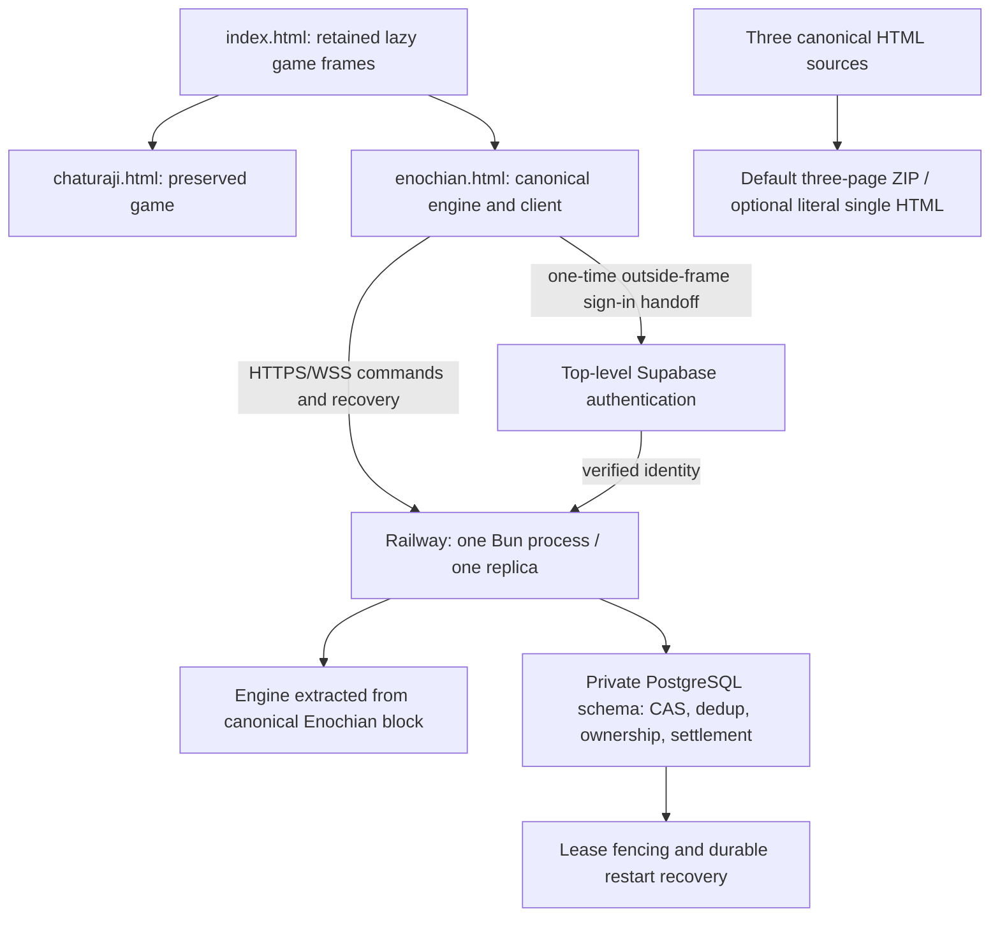

## Summary

This PR makes the existing chess client maintainable, repairs Enochian CPU play, and adds authoritative private casual and ranked multiplayer with durable recovery. The original Enochian CPU could overlook an available king capture, produce `NaN` evaluations for typed pawns, and leave obsolete turn callbacks running after a reset or menu transition. The original client also hid both games in whole-page Base64 payloads and had no separate-device room, authenticated seat ownership, durable command ledger, or reconnect policy.

The resulting client has three readable canonical HTML pages, one shared Enochian rules implementation, an inline pinned multiplayer SDK, and a server that persists each accepted action before acknowledging it. Local gameplay retains its established mechanics. New multiplayer policies are explicit, tested extensions rather than incidental changes to historical rules.

### Readable pages and preserved launcher behavior

`index.html` now loads `chaturaji.html` and `enochian.html` through exact relative paths. Each frame is assigned once and kept alive while switching games, preserving its browsing context and current match. Both menu paths and the direct `window.parent.addGameSession` statistics bridge remain available. The source launcher stays locked to its approved migration; later work does not change its layout, artwork, navigation, storage keys, or loader.

Chaturaji is byte-identical to the original decoded game. Enochian retains the protected original markup, CSS, inline art, and storage/statistics contracts outside its approved script and marked multiplayer insertion boundaries. Preservation checks enforce those boundaries instead of accepting a broad visual approximation. Whole-game Base64 is removed from the editable sources; existing small inline artwork remains embedded.

### Enochian CPU and one canonical engine

The CPU evaluation now handles typed pawn values and king importance without undefined arithmetic. Simulations carry the relevant alive/frozen state, apply canonical capture and promotion outcomes, and evaluate successors consistently. Difficulty choices remain bounded and operate on the existing legal move set. The lifecycle owns a single pending turn job and invalidates stale callbacks across reset, internal menu, return to the launcher, and reopening a game. Hidden or obsolete sessions cannot advance a newly opened match.

The DOM-free engine is extracted from a protected canonical block in `enochian.html` for server builds and test fixtures. This avoids independently maintained client/server rules. Parity coverage checks 120 deterministic positions and 1,745 successor states using seed `73272346`. Existing alliances, external throne geometry, freezing, movement, captures, promotion, and terminal outcomes remain the basis for both local and online play. Historical concourses, check obligations, throne seizure, and other audited omissions are not silently introduced.

### Authoritative commands and private casual rooms

Private invitations provide public room codes, explicit seat ownership, color selection, readiness, and lobby transitions. A room code grants access to join a room; it is not a credential to reclaim somebody else's seat. Recovery uses a separate private credential and stable application match ID, independent of transient Colyseus session/room identifiers. Public snapshots use explicit allowlists and exclude owner hashes, recovery secrets, private capture ledgers, and account administration data.

Moves carry a match ID, request ID, and expected revision. The server derives the actor from the authenticated connection, verifies ownership/phase/turn, validates through the canonical engine, and commits with compare-and-swap. Actor-scoped durable request deduplication runs before revision rejection so retrying a committed action returns its original result instead of applying it twice. Persistence precedes acknowledgement and broadcast. Competing commands cannot both commit the same revision, and rejected candidates do not partially mutate the stored match.

Casual rooms use server-controlled bots for appropriate unoccupied or disconnected seats. Reclaim and bot turns serialize against the same durable state. Each human has a cumulative 180-second absence allowance; repeated drops consume the remaining allowance rather than resetting it, and delayed maintenance cannot extend an expired seat. A returning owner receives the latest accepted bot moves. Terminal matches remain final even when a recovery attempt arrives within a previous allowance.

### Durable storage, fencing and service recovery

The PostgreSQL adapter stores full private match records, events, deduplication results, admission ownership, deadlines, and settlements in a dedicated private schema. It uses the selected Supabase PostgreSQL Session pooler with strict CA validation. Database credentials stay server-side. An explicit operator migration establishes the schema; startup verifies the expected migration/schema hash and does not run automatic DDL.

A session advisory lease and fencing protect the approved single authoritative process. Readiness fails closed until schema verification, durable ownership, and recovery complete. Restart recovery uses durable snapshots and absolute deadlines rather than relying on in-memory timers or Colyseus reconnect tokens. Service interruptions have an independent 300-second recovery grace and are distinguished from player abandonment. Infrastructure outage time does not silently consume a player's absence budget or charge all players a penalty. Recovery returns final snapshots for completed matches rather than reopening them.

### Approved human prisoner exchange

Multiplayer exchange requires two connected human captors with active, alive armies and the qualifying private capture ledger. Frozen/dead armies and bot or temporary-bot captors cannot negotiate. Offers bind both captors, both prisoners, ownership, and revision. They expire strictly at 60 seconds and invalidate on any move, control change, pause, or end. The approved G4 policy permits a qualifying offer immediately after the counterpart's allied king is captured or on the eligible captor's later own turns; documentation separates this adopted extension from the historical source's second-captor timing.

Acceptance restores only the two kings, atomically. It first considers their own empty safe thrones, then empty unthreatened squares ordered by king-step distance, fixed color order, and row/column. Safety is evaluated with both armies thawed and both restored kings present, using canonical attack logic. The complete geometry gives a bounded maximum of 4,225 pairs. If no safe pair exists, the command returns a structured placement failure without changing the match. Terminal results cannot be reversed by a late acceptance, and duplicate acceptance or two racing acceptors cannot produce two exchanges. Local play and AI negotiation are unchanged.

### Ranked identity, pause and exactly-once settlement

Ranked entry requires fresh server verification of the Supabase identity and four distinct human owners. Admission and active-match locks prevent concurrent ranked participation and survive restart. Client-supplied owner IDs, platform labels, or cached account claims are not authority. Ranked ownership is reauthenticated where required; no bot substitutes for a missing ranked human.

A ranked departure pauses immediately. Each color has a cumulative 300-second player-absence budget with strict deadlines; the match resumes only when all four humans are connected. Intentional leave and expired player absence follow the approved abandonment policy. Service recovery uses its separate grace and does not turn an infrastructure interruption into abandonment. Paused rooms reject moves and exchange commands.

Normal settlement uses team Elo with `K=32`; abandonment applies `-32` to each qualifying offender and a 600-second entry restriction, while unaffected players receive no abandonment rating change. Terminal settlement, rating writes, cooldown/restriction persistence, and admission-lock release are idempotent and atomic. Retried maintenance or recovery cannot apply a rating change twice. Ranked remains disabled until live identity/provider and release acceptance gates pass.

### Embedded client, top-level sign-in and transport protection

The multiplayer client handles create/join, ready state, snapshots, revisioned acknowledgements, bots, manual codes, recovery, and public exchange eligibility. It displays authoritative outcomes and pauses rather than allowing local UI state to become server authority. An expiring, one-time private handoff supports top-level sign-in outside restrictive platform frames, with PKCE and a manual return-code fallback. The handoff uses random secrets stored as hashes; Supabase verifies the account token, and the server verifies identity again before accepting the handoff. The handoff itself is not a signed token or an identity claim.

Pinned Colyseus and Supabase browser bundles are embedded inline with source hashes and bundled MIT notices. There is no mandatory runtime CDN. The client publishes only the public backend endpoint, never database credentials or service keys.

Transport protection covers raw Bun requests and WebSocket upgrades, supplementing room authorization with exact origin allowlists, HTTPS/WSS policy, byte caps, and bounded fixed-window abuse controls. Matchmaking, preflight, invitation/authentication attempts, and room actions require coverage at their actual transport boundary; Express fallback middleware alone is insufficient for the installed Bun transport. Origin checks supplement identity. Opaque `null` origins are denied, absent-Origin native clients have an explicit policy, and forwarded headers are not blindly trusted for source identity or TLS. Maps reject new keys when full, denied attempts do not extend windows, and the implementation creates no unbounded request timers. Hosted ingress and actual nested platform origins remain release checks.

### Runtime, deployment and packaging

The approved runtime is Bun `1.4.2`, with frozen `server/bun.lock`. Exact direct runtime pins are `@colyseus/bun-websockets@0.18.3`, `@colyseus/core@0.18.18`, `@colyseus/schema@5.0.35`, `@colyseus/sdk@0.18.4`, `@supabase/supabase-js@2.117.2`, and `pg@8.23.1`. Development pins are TypeScript `7.0.2`, `@types/bun@1.4.2`, `@types/node@24.19.1`, and `@types/pg@8.23.1`. Dependency approval, package purposes, inline bundle licenses, and local experimental Bun transport acceptance are recorded in `docs/multiplayer/`.

The root-context Docker build includes the canonical HTML and extraction/build scripts, installs frozen production dependencies, and starts compiled `dist/index.js`. Railway binds the injected `PORT` on `0.0.0.0`; `/health` checks liveness and `/ready` gates playable service availability. Production is one process/replica, without Redis or serverless sleeping.

The approved Railway project/service is deployed in US East Metal with one replica and sleeping disabled. [The live arcade](https://game-server-production-5449.up.railway.app/index.html) serves the configured canonical client. Deployment `794a55b9-7014-4135-9ec9-cabc0958a684` succeeded from `807bbec`; external health/readiness returned 200 with Bun 1.4.2. Two real hosted browser tabs created/joined a room, both readied, synchronized Red/Blue moves over WSS, and received server bot turns. The account remains on Hobby; the saved compute spending cap is $10 with a $5 alert. The source is the current `codex/task-0-readable-game-pages` branch until the user's post-merge swap to `main`. Physical-device acceptance and controlled cutover/restart remain separate checks.

`scripts/package-client.mjs` generates a deterministic default ZIP containing exactly `index.html`, `chaturaji.html`, and `enochian.html` at its root. The optional `--single-html` export safely serializes literal canonical sources into generated `srcdoc` loading, without whole-game Base64 or maintained duplicates. Decoded game bytes, inline SDK/license/version content, parent bridges, and launcher behavior survive. Fixed ZIP order/date and STORE compression avoid compressor/version/time-zone drift. Backend sources, migrations, tests and secrets are excluded. Generated artifacts stay under ignored `dist/`.

### Documentation and scope

The rule audit, execution plan, dependency approvals, protocol/client protocol, casual/recovery/ranked/exchange policies, operations guide, and release checklist describe implemented behavior and unresolved release gates. Future single-player or AI-captor exchange remains deferred. The superseded Colyseus issue draft is canceled; this PR does not publish that issue or create a replacement. Unrelated README hero deletion is excluded.

## Evidence

- **Before:** whole-game Base64 obscured editable sources and the launcher could not provide readable independent pages. **After:** exact Chaturaji decoded bytes and the approved launcher are protected by executable preservation checks; both frames retain state and shared statistics.
- **Before:** typed-pawn evaluation could become `NaN`, a legal move could produce no CPU selection, and available king captures could be missed. **After:** reproducible regressions and lifecycle tests cover evaluation, capture outcomes, resets, menus, hidden frames and obsolete callbacks.
- **Engine parity:** 120 positions / 1,745 successors, seed `73272346`, compare the canonical engine against preserved behavior.
- **Latest default backend batch:** 138 passed, 7 hosted checks skipped, 0 failed, 9,378 assertions across 145 cases. The separate approved hosted Supabase batch covered all seven skipped checks: 12 passed, 0 failed, 138 assertions across compatibility, runtime, store, durable-crash, ranked-admission, pending-recovery and settlement files. These overlap five default cases; do not add them into a synthetic total. No local PostgreSQL was installed or used.
- **Latest frontend batch:** 83 passed, 0 failed. The client suite has 14 cases including execution of the actual sign-in button handler. The separately recorded handoff suite passed 8 tests with 78 assertions.
- **Actual browser smoke:** two tabs completed real create/join, readiness, moves, bots and menu/state flows. This establishes local browser integration, not separate physical-device or external platform acceptance.
- **Packaging:** five focused tests passed for ZIP contents/CRC/directories, reproducibility, malicious script delimiters, canonical byte parity and retained loader/bridge behavior. Preservation passed. An independent .NET ZIP reader confirmed exactly the three root HTML entries.
- **Private application schema:** the explicit approved operator command initialized `enochian_chess` on the supplied Supabase Session pooler and verified migration version 1. Startup still performs verification only.
- **Hosted deployment:** successful real Railway build, strict-TLS Supabase connection, readiness and HTTPS website, plus two-tab WSS lobby/move/bot smoke. Controlled restart remains pending.
- **Pending:** physical-device casual/ranked acceptance, live provider configuration, authorized platform draft embeds and backup restoration. No result is claimed for an unfinished action.

This is one PR for Tasks 0–15, with one checkpoint commit per task. Task 12 is `30464ee`, Task 13 is `1c0f716`, Task 14 is `807bbec`, and Task 15 is `c13b3ad`, including both READMEs. Final end-only specification and quality reviews found three defects, all corrected and independently rechecked: the sign-in button now creates its handoff with POST; the root/query URL serves exact launcher HTML through the installed Bun/Colyseus dispatch; and finished/void rooms stop polling and dispose when empty while preserving final HTTP recovery. One final review correction commit follows the task checkpoints in the same PR. Previously published history is retained; no further actionable review findings remain.

## Merge Danger

**Door:** Two-way for source changes; durable production state requires a compatible rollback.

The PR does not make destructive schema changes automatically at startup, deploy itself, or enable ranked merely because tests pass. Client/server rollback must preserve matching protocol and engine versions. Once live matches, ratings and admission records exist, reverting only code cannot undo those records or safely reinterpret an incompatible schema. Backups, schema hash checks, retention and recovery evidence are release requirements.

**Blast Radius:** Multiplayer.

The online path spans browser frames, authentication, server authority, persistence and deployment ownership. Incorrect origin/ingress configuration can block legitimate clients; an incompatible client/server pair can reject commands; an unsafe lease cutover can keep the replacement unready; incorrect settlement/recovery would affect seats or ratings. Local gameplay and Chaturaji have explicit preservation coverage, while platform/mobile/device acceptance remains a separate gate.

### Required post-merge actions

1. A human merges the reviewed PR. Do not automatically merge from this implementation task. Confirm final task checkpoints, independent review findings, compatible protocol/engine hashes and recorded test results first.
2. Retain the previous verified artifact, exact commit reference and operational rollback instructions. Verify a database backup/PITR recovery path privately before activation. Preserve match, account, rating, cooldown and admission records; apply only the explicitly reviewed compatible operator migration and verify its schema hash. Never treat a failed readiness check as permission to clear durable records or run ad hoc DDL.
3. **After merge**, change the Railway GitHub source branch from `codex/task-0-readable-game-pages` to `main`. Verify root build context, frozen pins, public endpoint, private server configuration, US East placement, one replica, sleeping disabled, cap/alert and `/ready` healthcheck. Do not expose secrets in source, artifacts, logs or the PR.
4. Use the reviewed drain/stop-old/start-new procedure for the PostgreSQL advisory lease. Ordinary replacement overlap is not a validated handoff: a new process can fail readiness while the old one owns the lease. Preserve durable records and recover them under the new owner. Do not weaken readiness or lease checks to force a green deployment.
5. Validate deployed `/health` and `/ready`, HTTPS/WSS, strict origin and raw payload/rate coverage, real authentication, stable application recovery, and a controlled restart. Retain the passing hosted-batch evidence and rerun relevant checks if deployment/configuration changes affect it. Confirm infrastructure interruption does not create abandonment penalties.
6. Regenerate both client artifacts from the merged canonical sources and the verified public endpoint configuration. Repeat preservation and packaging checks; retain artifact hashes and compatible server/client versions. Test local/offline gameplay as applicable and same-origin HTTP subdirectory preview; the three-page launcher alone is not a standalone offline artifact.
7. Complete casual acceptance on 2–4 separate physical devices and ranked acceptance with four distinct human accounts/devices, including bots/reclaim, exchange, pause/resume, timeout, settlement and restart recovery. Keep ranked disabled until these and identity/admission gates pass. Two tabs do not satisfy device acceptance.
8. Obtain the remaining approval for provider email/social configuration and any platform draft uploads. Verify actual nested relative-source and optional `srcdoc` origins, top-level sign-in/PKCE return fallback, manual codes, statistics, artwork, mobile/fullscreen/audio, and authentication/recovery in authorized itch.io/Newgrounds drafts. Publication is another explicit action.
9. Remove the feature branch only after the Railway source swap succeeds and a durable rollback reference/artifact is retained. Branch cleanup must not remove the only deployment or rollback reference.
